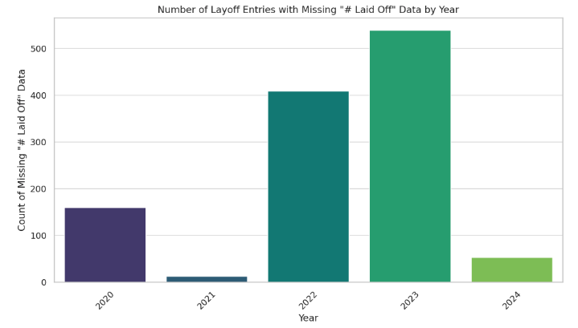
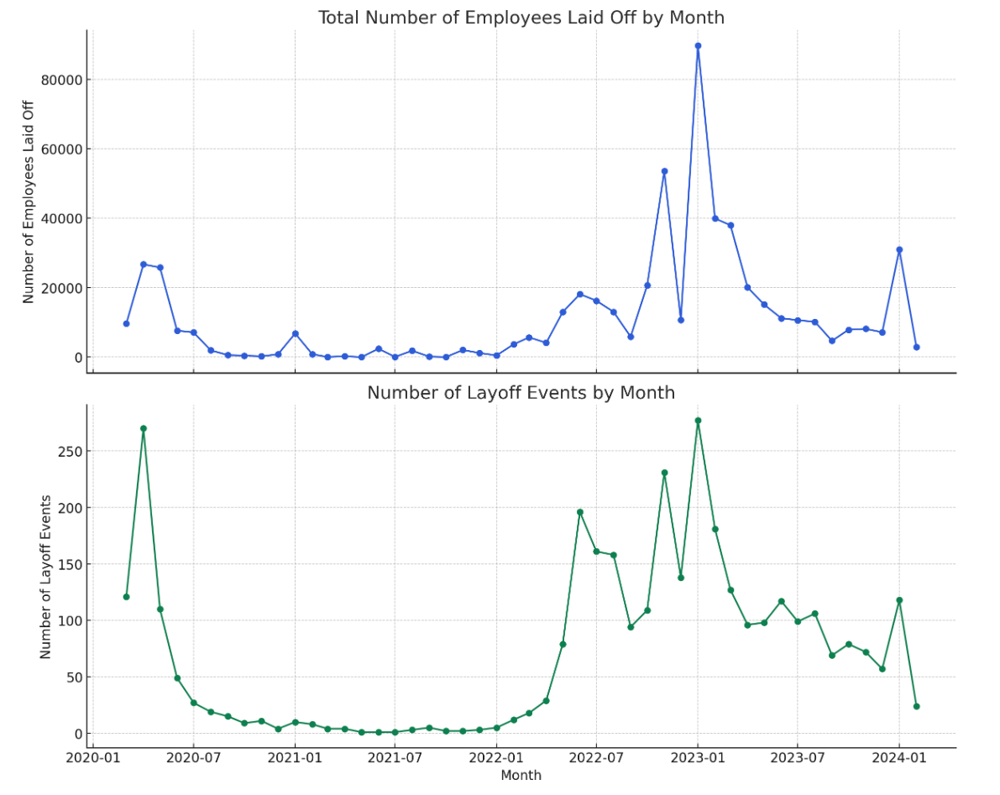
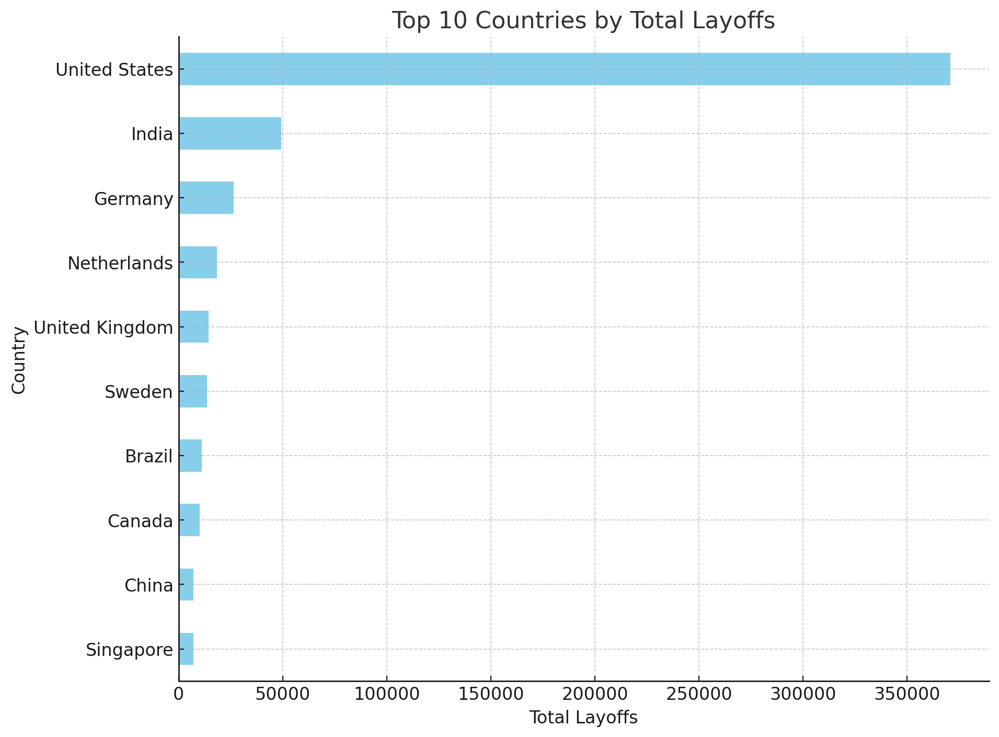
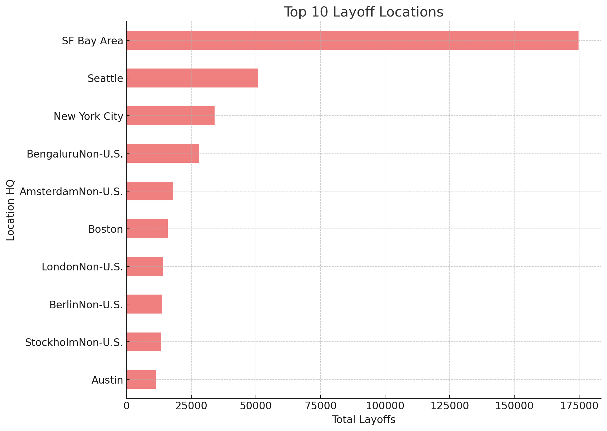
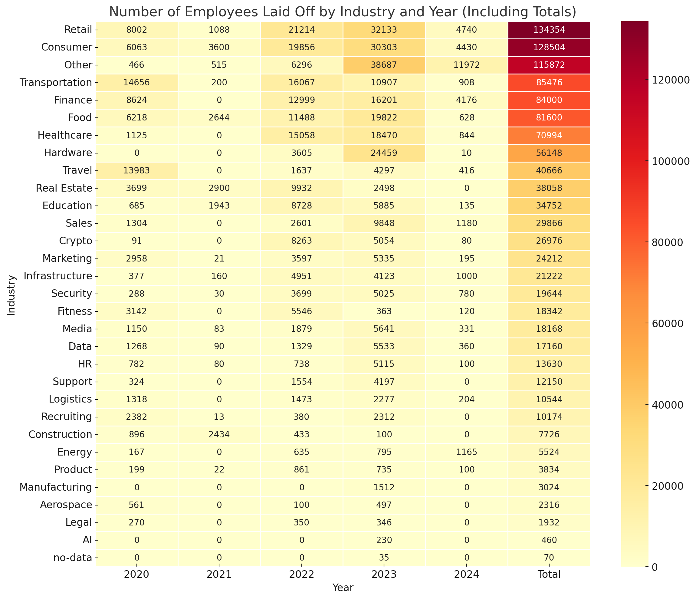

# CDSP Project Group 2 README.md

This repository is a research conducted by group 02 which consists of Emerging Talent participants in an attempt to clarify the current situation in the information technology market nowadays.

 

## Project Idea: Trending Layoffs in the IT Sector

## Domain: IT Sector

### Problem Statement

In recent times, the IT sector has undergone a notable transformation in hiring practices, influenced by multiple factors. We hypothesize that this shift is primarily due to three key factors: economic trends and inflation, the advent of new technological tools, and the alignment of IT companies' growth trajectories with contemporary trends. These elements have collectively led to a more stringent hiring process. Moreover, the IT industry experienced significant layoffs in 2023, with approximately 200,000+ personnel affected during a major layoff period. This development necessitates a thorough analysis of the sector's future prospects.

### Current Research Objective

Our team is interested in exploring the future prospects for individuals seeking a career in the IT sector, the potential disadvantages awaiting them, and the possible paths to success based on available data.

### Constraints

A major challenge in this study is the lack of specific layoff numbers for each company, as well as difficulty in obtaining detailed information about different industry sectors and their employees. To address these issues, we plan to group companies by location and use substitute data when precise information is unavailable. Our main goal is not to ascertain exact numbers for every company but to obtain a broad view of the industry as a whole, enabling us to understand the patterns and connections within these trends.

### Stakeholder or Target Audience

This research is especially relevant to our cohort and the students at MIT Emerging Talent who are likely to seek employment in the IT field. Given the increasing reliance on technology and remote work, IT skills have become nearly indispensable. However, the IT sector is vast and continuously branching into numerous subfields.

### Data Modeling Strategy

## A Multi-Variable Analysis Approach

### Objectives:
- Conduct exploratory data analysis to uncover patterns and insights related to tech layoffs.
- Identify potential factors contributing to tech layoffs and their effects on the industry.
- Explore temporal, geographic, and industry-specific trends in tech layoffs.
- Investigate correlations between company characteristics (e.g., stage, funding) and layoff likelihood.
- Assess the scale and impact of tech layoffs in terms of affected employees and industries.

### Dimensions of Analysis:
- **Trend Over Time:** Understand how tech layoffs have evolved over time.
- **Geographic Distribution:** Analyze the locations of companies conducting layoffs.
- **Impact by Industry:** Identify the tech sectors most affected by layoffs.
- **Company Stage and Financial Health:** Investigate how a company's stage and funding relate to layoff likelihood.
- **Scale of Layoffs:** Assess the magnitude of layoffs in terms of affected employees.
- **Correlation Analysis:** Explore if layoff timing correlates with specific geographic locations.

Using the above mentioned various perspectives we'll be examining and analyzing our data on tech layoffs.

## Analysis

### Overview of the Data

Below we have selected a subset of columns that provide a good overview of our dataset on IT-Layoffs

| Company    | Location HQ   | # Laid Off   | Date       | Industry   | Source                                                                                                                     |
|:-----------|:--------------|:-------------|:-----------|:-----------|:---------------------------------------------------------------------------------------------------------------------------|
| Grammarly  | SF Bay Area   | 230          | 2024-02-07 | Consumer   | [source](https://elbuz.com/en/grammarly-skorochue-230-chleniv-komandi-37-z-yakikh-v-ukraini)                               |
| Fireblocks | New York City | 20           | 2024-02-07 | Crypto     | [source](https://www.calcalistech.com/ctechnews/article/rjkvszzit)                                                         |
| Workfellow | EspooNon-U.S. | no-data      | 2024-02-07 | HR         | [source](https://tech.eu/2024/02/07/finnish-hrtech-startup-workfellow-announces-shutdown-amid-challenges/)                 |
| DocuSign   | SF Bay Area   | 440          | 2024-02-06 | Sales      | [source](https://www.cnbc.com/2024/02/06/docusign-to-lay-off-6percent-of-workforce-or-about-440-jobs.html)                 |
| Amazon     | Seattle       | 400          | 2024-02-06 | Retail     | [source](https://www.businessinsider.com/amazon-one-medical-pharmacy-layoffs-broader-cost-cutting-campaign-2024-2)         |
| Snap       | Los Angeles   | 500          | 2024-02-05 | Consumer   | [source](https://www.cnbc.com/2024/02/05/snap-to-lay-off-10percent-of-global-workforce-around-500-employees.html)          |
| Drizly     | Boston        | 168          | 2024-02-05 | Retail     | [source](https://www.boston.com/news/business/2024/02/05/uber-drizly-to-lay-off-168-boston-workers/)                       |
| BillGO     | Fort Collins  | 80           | 2024-02-05 | Finance    | [source](https://www.coloradoan.com/story/money/business/2024/02/05/billgo-announces-80-layoffs-at-fort-collins-office/72484159007/) |

### Layoff Dataset Overview

The dataset contains information on tech layoffs, with 3,429 entries and 13 columns. Below is a summary of what each column in the dataset represents:

- **id**: A unique identifier for each entry.
- **Company**: The name of the company.
- **Location HQ**: Headquarters location of the company.
- **# Laid Off**: The number of employees laid off.
- **Date**: The date of the layoff.
- **%**: Percentage of workforce laid off. Some entries are marked as "no-data".
- **Industry**: The industry sector of the company.
- **Source**: Source of the layoff information.
- **List of employees laid**: Intended for names or roles of laid-off employees, but is filled with "no-data".
- **Stage**: The stage of the company (e.g., Seed, Series A, Post-IPO).
- **$ Raised mm**: The amount of money raised by the company, in millions.
- **Country**: The country of the company's headquarters.
- **Date added**: When the layoff information was added to the dataset.

This dataset serves as a resource for analyzing layoff trends, the financial health of companies, and the impact of economic conditions on employment across different sectors.

### Missing Data

The dataset we have used for analysis is a well collected data except the missing values on "Laid Off" column, in which number of laid off employees are given. Out of 3,429 entries, there are 1,174 missing laid-off data. Which is almost a 33% of the total dataset. The second most missing data is the "Raised mm", in which the amount of money raised by the company is given. This is not very relevant data, therefore, it has low impact on our analysis. Below you can find the year by year basis of the missing data of "Laid Off"

**2020**: 160 entries with missing data on the number of employees laid off.
**2021**: 13 entries with missing data.
**2022**: 409 entries with missing data.
**2023**: 539 entries with missing data.
**2024**: 53 entries with missing data.

### Timeline and Trend

The timeline illustrates the trend of layoffs between 2020 and 2024, presented in two charts: the first chart depicts the number of employees laid off, while the second chart shows the number of layoff events that occurred. A generally consistent ratio is observed between the data across the timeline. However, three periods stand out as exceptions: the first half of 2020, the first half of 2022, and the last half of 2023. In these specific periods, even though the number of layoffs was high, the number of employees affected was comparatively lower.

From the data, it's evident that the main trend of layoffs began in the second quarter of 2022, around March, peaking at the beginning of 2023 with over 80,000 people affected. This trend then experienced a significant decline towards the end of 2023. A resurgence in layoffs is observed starting in 2024.

The analysis suggests that during the initial phase of the COVID-19 pandemic, there were relatively few layoffs. However, the post-COVID era ushered in an unforeseen pattern of change, resulting in a substantial increase in layoffs within the IT sector. This surge is attributed to the industry's efforts to adapt to the new norms and challenges presented by the post-COVID landscape.

### Location and Reports

Analysis and findings to be written.

#### Top 10 Countries by Layoffs:
1. **United States:** 370,798 layoffs
2. **India:** 49,379 layoffs
3. **Germany:** 26,293 layoffs
4. **Netherlands:** 18,355 layoffs
5. **United Kingdom:** 14,394 layoffs
6. **Sweden:** 13,539 layoffs
7. **Brazil:** 11,143 layoffs
8. **Canada:** 10,041 layoffs
9. **China:** 7,190 layoffs
10. **Singapore:** 7,095 layoffs

#### Top 10 Layoff Locations:
1. **SF Bay Area:** 174,750 layoffs
2. **Seattle:** 50,856 layoffs
3. **New York City:** 34,067 layoffs
4. **Bengaluru (Non-U.S.):** 28,006 layoffs
5. **Amsterdam (Non-U.S.):** 17,975 layoffs
6. **Boston:** 15,891 layoffs
7. **London (Non-U.S.):** 14,076 layoffs
8. **Berlin (Non-U.S.):** 13,726 layoffs
9. **Stockholm (Non-U.S.):** 13,492 layoffs
10. **Austin:** 11,487 layoffs

### Industry and Impact

Analysis and findings to be written.

### Interview with Experts

Note down the expert's observations and notes on the topic

## Findings and Conclusion

Conclusion parts to be written down

